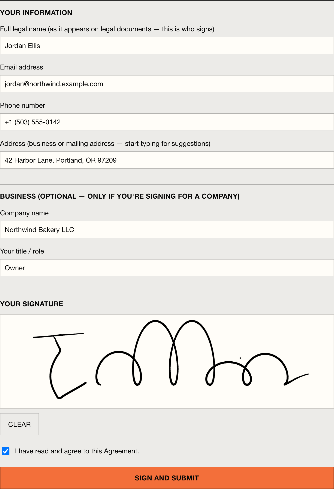
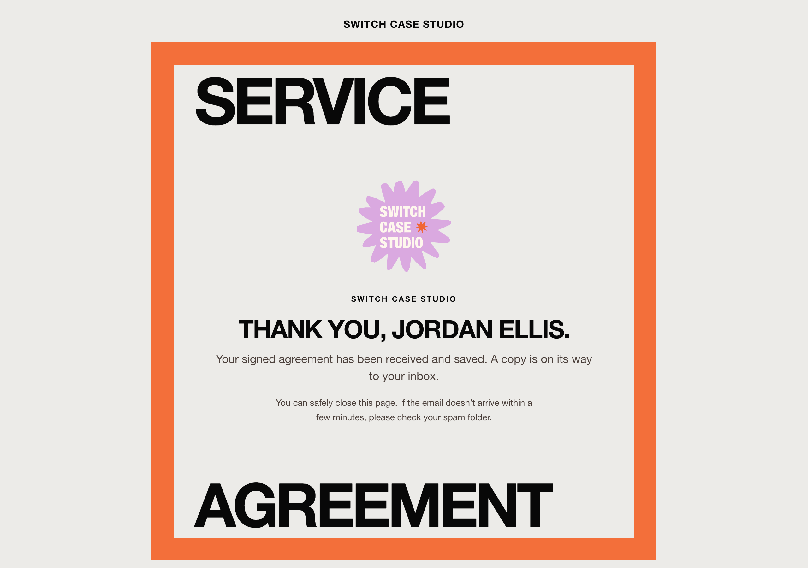
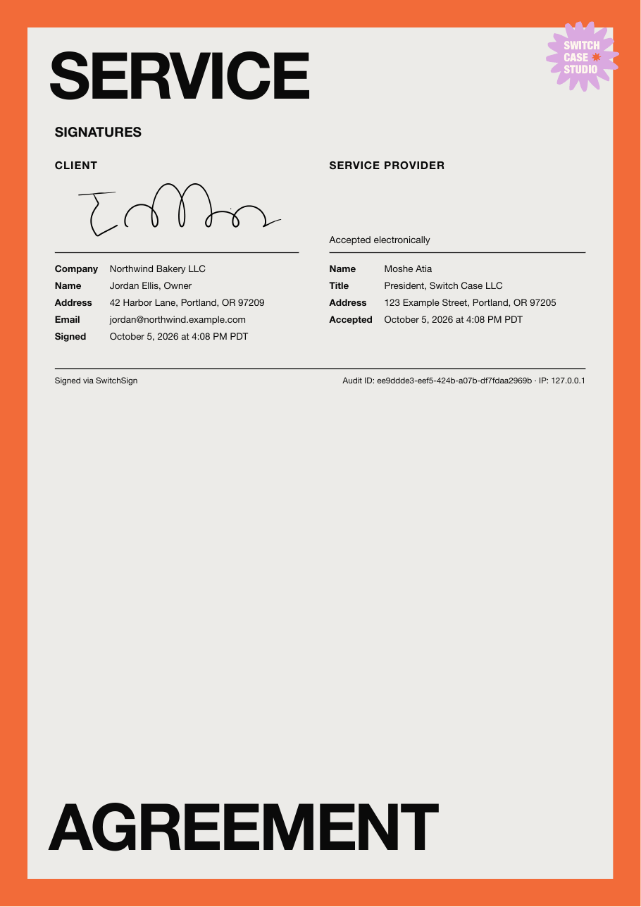

# SwitchSign

**Self-hosted contract generation and e-signing, built for Switch Case Studio and in production since May 2026.**

Clients get a branded signing link, read the agreement, draw their signature and
submit. SwitchSign then produces a signed PDF with an audit trail, stores it and
emails copies to both sides. An AI agent can draft and send the contract from a
short chat, and a CLI does the same job when the agent isn't available.

> **Showcase repository.** This is the source of a production app, published so
> people can read how it's built. It is not open source: see [License](#license).
> The contract templates here are short samples, not real legal agreements.

| Review the agreement | Fill in and sign |
|---|---|
|  |  |

| Confirmation | Signed PDF: cover | Signed PDF: signatures + audit |
|---|---|---|
|  |  |  |

*Screenshots use a made-up client (Northwind Bakery) on a local install.*

## How it works

1. **Draft.** An AI agent (or the CLI) collects the project details, asks follow-up
   questions for anything missing, and renders the agreement from a Jinja template.
2. **Send.** A protected API call stores the contract and returns a private signing
   link that expires after 7 days.
3. **Sign.** The client reviews the agreement, enters their details (with address
   autocomplete), draws a signature on a canvas and agrees.
4. **Seal.** SwitchSign renders a branded PDF with both parties' details, the
   signature and an audit ID, uploads it to cloud storage and emails copies to
   the client and the studio.
5. **Follow up.** Background jobs send reminders, expire stale links and retry any
   upload that failed.

Every step is written to an audit log (IP, user agent, timestamps).

## Highlights

- **AI-agent integration.** A tool definition plus a system prompt that makes the
  agent ask clarifying questions instead of guessing names, prices or terms
  (`integrations/openclaw/`). The CLI fallback renders the exact same document.
- **Branded PDFs.** WeasyPrint turns an HTML/CSS template into a print-quality,
  on-brand agreement, not a generic e-sign certificate.
- **Safe by default.** Signing tokens are 192-bit random and expire; admin routes
  need an API key checked in constant time; contract markdown is sanitized
  (bleach allowlist) before it's rendered; signature uploads are size-checked.
- **Small and boring to run.** One Python service, SQLite, Docker Compose behind
  Traefik. No SaaS e-sign subscription.

## Tech stack

Python 3.12 · FastAPI · SQLAlchemy + SQLite · Jinja2 · WeasyPrint · APScheduler ·
Google Cloud Storage · Resend · Google Places API · Docker + Traefik

```
src/switchsign/
  api/          admin API (API key) and public signing routes
  services/     PDF rendering, email, storage, markdown sanitizing, tokens
  jobs/         reminders, link expiry, upload retries
  templates/    signing pages, PDF and email templates
integrations/openclaw/   AI-agent tool, system prompt, sample contract templates
scripts/                 CLI contract generator + runbook
```

## Running it

### How to run locally

```bash
cp .env.example .env
# Fill in the values; dummy integration secrets are fine for local dev.
docker compose up --build
```

Health check:

```bash
curl http://localhost:8000/healthz
```

### How to reset DB

```bash
docker compose exec switchsign python scripts/reset-db.py
```

### How to seed a test contract

```bash
docker compose exec switchsign python scripts/seed-test-contract.py
```

### Generate a contract without the agent (manual fallback)

When the AI agent (e.g. Sage) is unavailable — out of tokens, down, whatever —
you can create a contract and signing link yourself from a short intake file.
Same templates, same output as the agent path. **No app build, Docker,
or local server needed** — the generator calls the live API.

> Step-by-step runbook (works for a human or an AI assistant like Claude Code):
> [`scripts/contracts/RUNBOOK.md`](scripts/contracts/RUNBOOK.md). A fresh clone
> just needs `pip install -r scripts/contracts/requirements.txt` and a `.env`
> with the API key. Quick version:

```bash
# 1) Copy the example and fill in the project details
cp scripts/contracts/intake.example.txt scripts/contracts/my-client.txt

# 2) Render + review (writes scripts/contracts/out/…md, sends nothing)
.venv-render/bin/python3 scripts/generate_contract.py scripts/contracts/my-client.txt

# 3) Create the signing link (needs SWITCHSIGN_BASE_URL + SWITCHSIGN_API_KEY in .env)
.venv-render/bin/python3 scripts/generate_contract.py scripts/contracts/my-client.txt --send
```

Required intake fields: `client_name`, `client_email`, `contract_title`,
`project_overview`, `deliverables`, `project_fee`, `timeline` (the script lists
anything missing). Optional `client_company` / `client_title` pre-fill the
signing form. Full walkthrough in
[`scripts/contracts/README.md`](scripts/contracts/README.md).

### Contract templates

The generator renders a Jinja2 template from
`integrations/openclaw/contract-templates/`. Choose one with `--template`
(defaults to `service-agreement.j2`):

- **`service-agreement.j2`** — general service / website agreement (the default).
- **`ecommerce-agreement.j2`** — reusable base for WooCommerce / multi-brand
  e-commerce store builds. Layers in e-commerce-specific terms (non-refundable
  payments, staging→go-live payment gate, prepaid support blocks, year-one
  hosting + domain-at-cost, asset-delivery deadline, SKU caps) plus optional
  multi-brand and barter-credit sections. Per-project values come from the
  intake; everything else has an e-commerce default, so a new store needs only
  the required fields above plus any numbers that differ (e.g. `sku_cap`,
  `brand_count`, `asset_deadline_days`, `support_block_price`). Set
  `multi_brand: no` for a single-brand shop.

```bash
# Render an e-commerce agreement (review only, sends nothing)
.venv-render/bin/python3 scripts/generate_contract.py scripts/contracts/my-store.txt \
    --template ecommerce-agreement.j2
```

### Admin API

All admin endpoints require `X-API-Key: $API_KEY`.

Create a contract:

```bash
curl -X POST "$SWITCHSIGN_BASE_URL/api/contracts" \
  -H "X-API-Key: $API_KEY" \
  -H "Content-Type: application/json" \
  -d '{"client_name":"Test Co","client_email":"test@example.com","contract_title":"Test","markdown_body":"## Hello"}'
```

List contracts:

```bash
curl "$SWITCHSIGN_BASE_URL/api/contracts" -H "X-API-Key: $API_KEY"
```

Get contract detail:

```bash
curl "$SWITCHSIGN_BASE_URL/api/contracts/$CONTRACT_ID" -H "X-API-Key: $API_KEY"
```

Cancel a pending contract:

```bash
curl -X POST "$SWITCHSIGN_BASE_URL/api/contracts/$CONTRACT_ID/cancel" -H "X-API-Key: $API_KEY"
```


### Public signing flow

After creating a contract through the admin API, open the returned `signing_url` in a browser. The page renders the markdown contract, collects the signer's details (full name, email, phone, business address) and a drawn signature, then marks the contract as signed and redirects to `/signed/{token}`.

On signing, the app stores the signature, generates a branded PDF, uploads it to Google Cloud Storage, and emails signed copies to the owner and client — see the sections below.


### PDF generation

Signed contracts generate a local PDF at `data/signed-pdfs/{contract_id}.pdf` during signing.

Regenerate a signed contract PDF:

```bash
curl -X POST "$SWITCHSIGN_BASE_URL/api/contracts/$CONTRACT_ID/regenerate-pdf"   -H "X-API-Key: $API_KEY"
```

Download a signed contract PDF:

```bash
curl -o signed-contract.pdf "$SWITCHSIGN_BASE_URL/api/contracts/$CONTRACT_ID/pdf"   -H "X-API-Key: $API_KEY"
```

### Email delivery

When a contract is signed, SwitchSign sends the signed PDF through Resend to both the owner and the client. Email failures are logged to the audit log and do not block the signing redirect.

Resend a signed contract email:

```bash
curl -X POST "$SWITCHSIGN_BASE_URL/api/contracts/$CONTRACT_ID/resend-email" \
  -H "X-API-Key: $API_KEY" \
  -H "Content-Type: application/json" \
  -d '{"to":"client"}'
```

Use `{"to":"owner"}` to resend the owner copy.

### Background jobs

SwitchSign starts APScheduler inside the FastAPI process. It runs:

- hourly expiry sweep for pending contracts past `expires_at`
- hourly reminder sweep for pending contracts older than `REMINDER_AFTER_DAYS`
- six-hour storage retry sweep for signed contracts with a local PDF but no storage path

Check job status:

```bash
curl "$SWITCHSIGN_BASE_URL/api/jobs/status" -H "X-API-Key: $API_KEY"
```

Manually trigger jobs:

```bash
curl -X POST "$SWITCHSIGN_BASE_URL/api/jobs/expiry-sweep" -H "X-API-Key: $API_KEY"
curl -X POST "$SWITCHSIGN_BASE_URL/api/jobs/reminder-sweep" -H "X-API-Key: $API_KEY"
curl -X POST "$SWITCHSIGN_BASE_URL/api/jobs/drive-retry-sweep" -H "X-API-Key: $API_KEY"
```

## License

Copyright © 2026 Switch Case LLC (Switch Case Studio). All rights reserved.

The source is published for viewing only. You may read it and link to it, but you
may not copy, modify, deploy or redistribute it without written permission. See
[LICENSE](LICENSE).

## Disclaimer

SwitchSign is provided "as is", without warranty of any kind. The sample contract
templates are illustrations, not legal advice: have a lawyer review any agreement
you use. Whether an electronic signature is valid for your agreement depends on
your jurisdiction.
